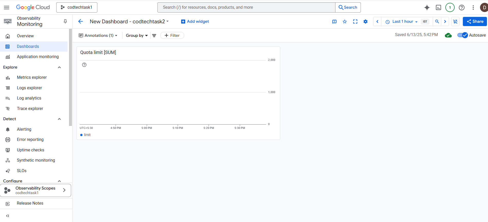
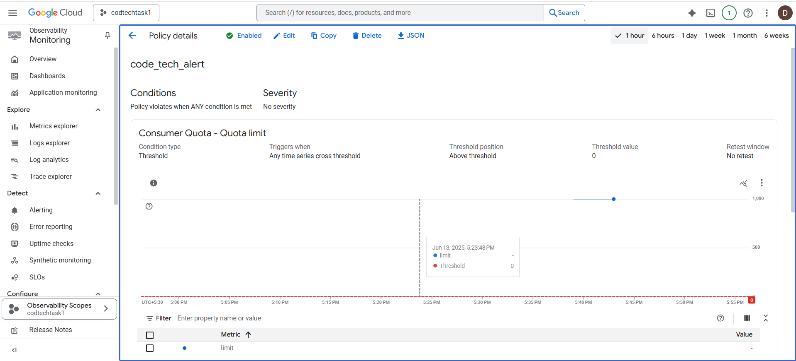

# CodTech Internship - Task 2

## ✅ Task: Cloud Monitoring and Alerts

This project demonstrates setting up **monitoring and alerting** using Google Cloud Monitoring as part of the CodTech internship.

---

## 🛠 Tools Used:
- Google Cloud Platform (GCP)
- Cloud Monitoring
- Alerting Policy

---

## 📊 What was done?

1. Created a **Cloud Monitoring Dashboard**
2. Added a **Quota Limit** chart using the metric:

3. Configured an **Alert Policy**:
- Trigger: If quota value is above 0
- Threshold: `0`
- Condition: Triggered any time the series crosses threshold

---

## 📸 Screenshots

### 1. Dashboard with Chart

### 2. Alert Policy Configuration

---

## ✅ Deliverables
- 📈 Configured Dashboard
- 🚨 Alert Policy Created
- ✅ Monitoring Setup Completed

---

## 📬 Submitted by:
**Dafni Tabitha S**  
CodTech Cloud Internship - June 2025
